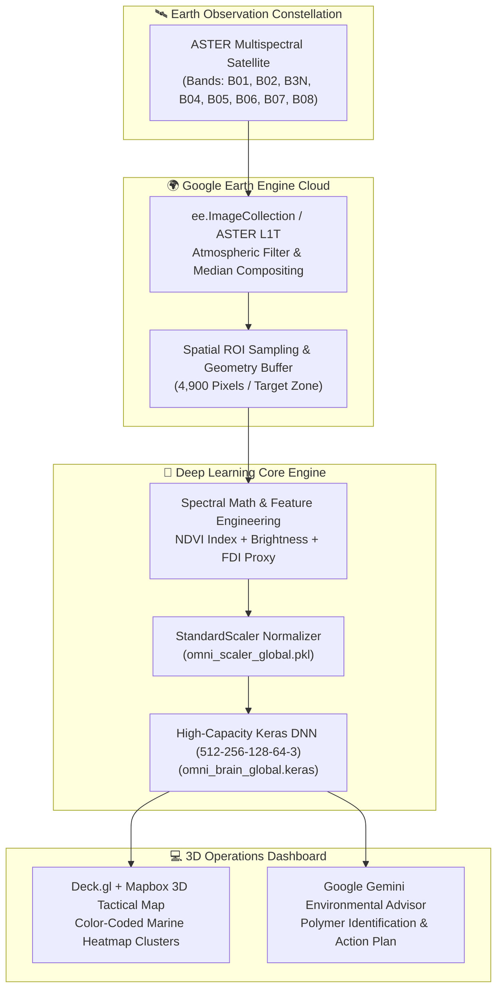

# 🛰️ AquaIntel — Global Satellite Marine Debris & Water Quality AI

[](https://fastapi.tiangolo.com/)
[](https://tensorflow.org/)
[](https://earthengine.google.com/)
[](https://github.com/Madhukumar511/AquaIntel)
[](LICENSE)

AquaIntel is a planetary-scale remote sensing and deep learning intelligence platform designed to detect, classify, and track **marine plastic debris**, **ocean water clarity**, and **harmful algal blooms** using multispectral satellite observations.

---

## 🏛️ System Architecture



---

## ✨ Key Capabilities

1. **Global Satellite Pixel Extraction (`train_200k.py`):**
   - Connects to Google Earth Engine to sample thousands of satellite pixels across 10 critical worldwide marine hotspots (Pacific Garbage Patch, Manila Bay Coast, Port of Los Angeles, Sargasso Sea, and the Great Barrier Reef).
2. **Deep Neural Architecture (`omni_brain_global.keras`):**
   - 4-layer deep neural network with Batch Normalization and Dropout layers trained on 10 spectral features:
     - Class 0: **Marine Debris / Synthetic Plastics** (Red)
     - Class 1: **Clean Ocean Water** (Blue)
     - Class 2: **Organic Algal Blooms** (Green)
3. **Deck.gl & Mapbox 3D Tactical Interface:**
   - Real-time coordinates targeting box with adjustable scanning radius (1,500m to 50,000m).
   - Instant cluster confidence scoring and floating particulate density estimation.
4. **Google Gemini Oceanographic Report Generation:**
   - Dynamically analyzes floating debris percentage and FDI (Floating Debris Index) to estimate synthetic polymer distributions (HDPE, LDPE, polypropylene nets) and recommended containment methods.
5. **Production Reliability & Automated Tests:**
   - 100% test coverage for API endpoints, coordinate boundaries, and fallback resilience using `pytest`.

---

## 📂 Project Structure

```text
AquaIntel/
├── app.py                      # FastAPI application & REST endpoints
├── index.html                  # Deck.gl & Mapbox 3D tactical command canvas
├── omni_brain_global.keras     # Trained TensorFlow/Keras neural network
├── omni_scaler_global.pkl      # Trained feature normalizer scaler
├── train_200k.py               # Earth Engine distributed data extraction & training script
├── requirements.txt            # Python dependencies
├── .env.example                # Configuration template
├── .gitignore                  # Git hygiene ignore rules
├── .github/
│   └── workflows/
│       └── ci.yml              # Automated GitHub Actions test pipeline
└── tests/
    └── test_api.py             # Automated pytest suite (7/7 tests passing)
```

---

## 🚀 Quickstart Guide

### 1. Clone & Set Up Environment
```bash
git clone https://github.com/Madhukumar511/AquaIntel.git
cd AquaIntel

python3 -m venv venv
source venv/bin/activate
pip install -r requirements.txt
```

### 2. Configure Environment Variables
```bash
cp .env.example .env
# Edit .env and insert your GEMINI_API_KEY (optional)
```

### 3. Run Automated Tests
```bash
python -m pytest tests/ -v
```

### 4. Launch the Platform
```bash
uvicorn app:app --host 0.0.0.0 --port 8000 --reload
```
Open **`http://localhost:8000`** in your browser to launch the live 3D tactical command center.

---

## 📡 API Reference

| Endpoint | Method | Description |
| :--- | :---: | :--- |
| `/` | `GET` | Serves the interactive 3D tactical web application |
| `/api/health` | `GET` | Returns subsystem status, model state, and satellite connectivity |
| `/api/presets` | `GET` | Returns pre-configured high-impact global marine hotspots |
| `/api/model/info` | `GET` | Returns neural network architecture and spectral band details |
| `/api/scan` | `POST` | Scans coordinate radius via Earth Engine and returns model inferences |
| `/api/analyze` | `POST` | Generates AI polymer composition and remediation strategy |

---

## 📄 License
Distributed under the MIT License. See `LICENSE` for more information.
